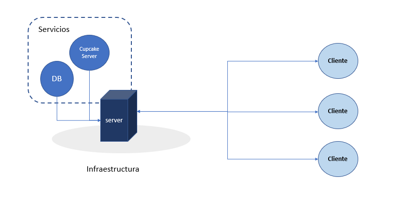
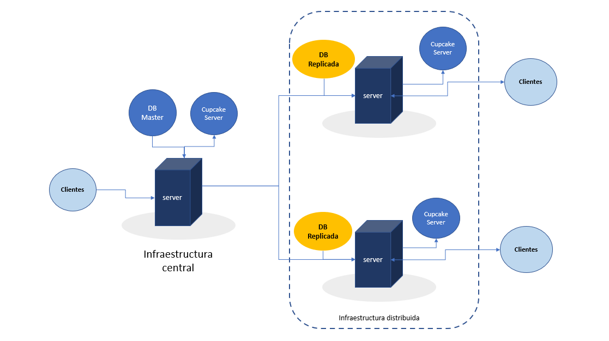

# ⚙Cupcake Core
Cupcake Core es el empaquetado de software que brinda servicios de comunicación
y transferencia de datos entre los clientes que hacen uso de la **Suite de Cupcake**.

El core, en su primera versión, implementa un servicio REST que permite almacenar y consultar 
información de la base de datos de cupcake.

## 📝Características
* Sistema de registros concurrente
* Conexión con base de datos MySQL
* Servidor REST

## 📋 Implementaciones
El Core esta pensado para funcionar en entornos de pequeñas y medianas empresas,
proveyéndolas de servicios escalables, por lo que cada una es libre de realizar una implementación local o distribuida según sean sus necesidades.

### 📍 Implementación local [En desarrollo]

Esta implementación permite a la empresa concentrar el flujo de datos dentro de su propia
organización, pudiendo o no, exponer los servicios de Cupcake Core para que otros usuarios fuera 
de su área de implementación puedan hacer uso de estos.

### 🌐 Implementación distribuida [En desarrollo]

En la implementación distribuida, Cupcake Core dota a la empresa con posibilidad de escalar su
flujo de datos en diferentes áreas de implementación.
Ya sea que se encuentren en diferentes zonas geográficas, cada una de las implementaciones 
podrá hacer uso de una copia de la base de datos de la infraestructura central, pero cada una 
podrá hacer uso de sus propios servicios.

Asimismo, Cupcake no se limita a una única instancia dentro de una infraestructura,
sino que además se puede dotar a la infraestructura con múltiples instancias de 
servicios escuchando en diferentes puertos. La configuración de esta queda a criterio de 
cada empres

## 🧾Licencia
Cupcake Core se encuentra bajo licencia MIT, por lo que cualquiera puede 
hacer uso de este core para implementarlo en sus propios proyectos, respetando las propias directrices de la licencia.
